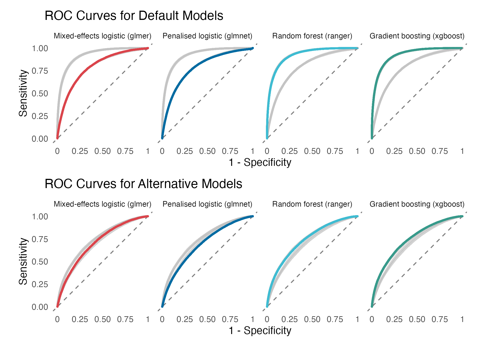
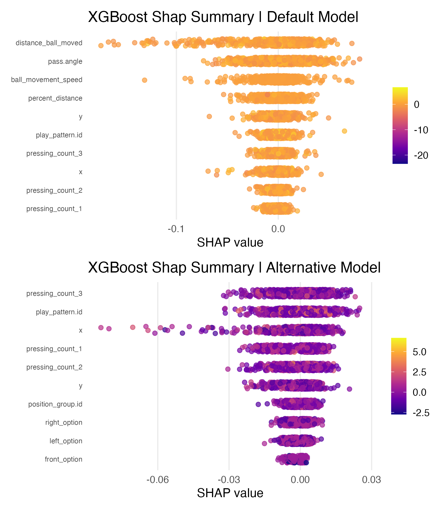
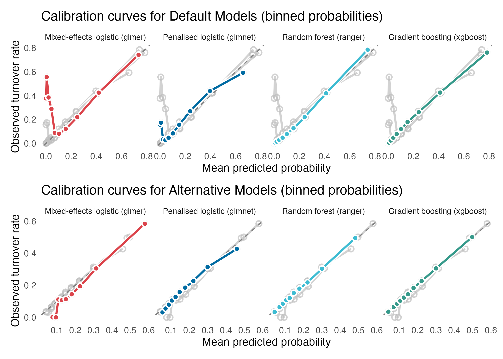
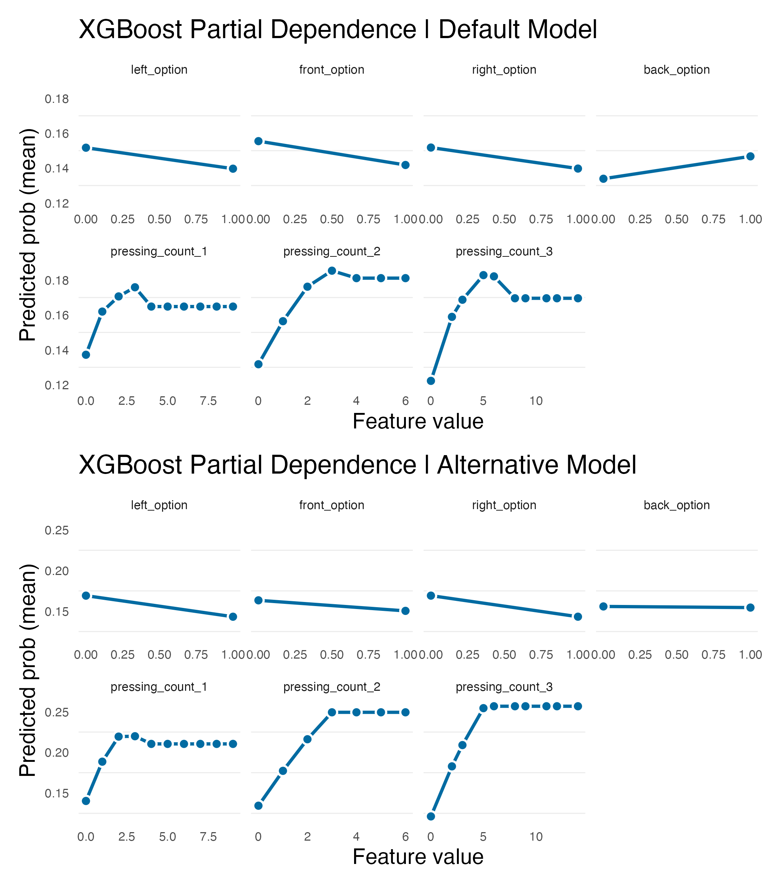
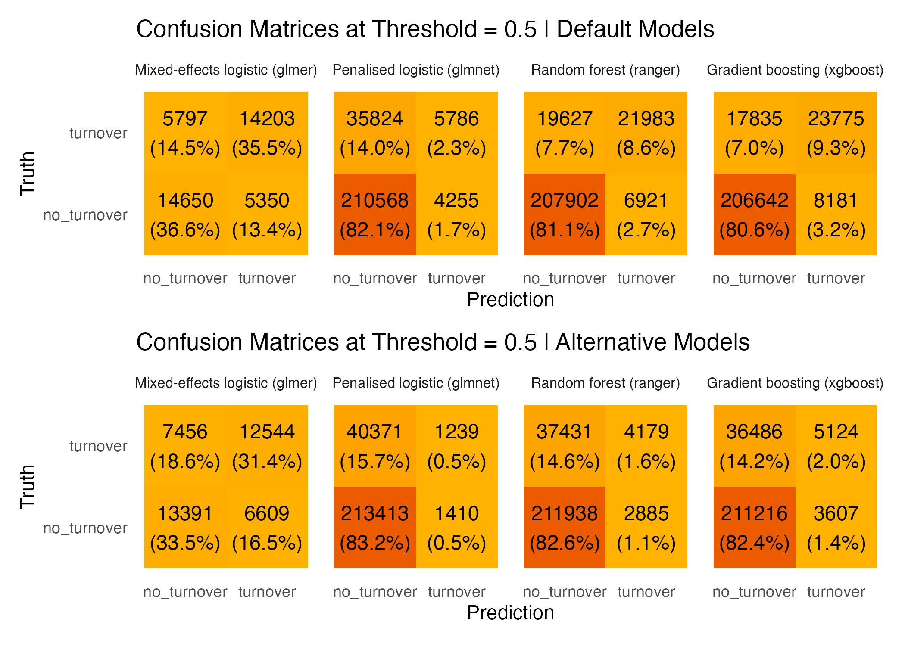

# When Timing Matters: Evaluating Temporal Leakage in Machine Learning Models of Football Pass Turnovers

[](https://github.com)
[](https://www.r-project.org/)
[](LICENSE)

> **Reproducible research workflow** supporting the manuscript "When Timing Matters: Evaluating Temporal Leakage in Machine Learning Models of Football Pass Turnovers" (Peters et al., under review).

## Overview

This repository provides a fully reproducible machine learning pipeline for evaluating temporal leakage in Expected Pass Turnovers (xPT) models. The workflow compares four algorithms—**mixed-effects logistic regression**, **penalised logistic regression**, **random forest**, and **gradient boosting**—across two feature configurations: default (leakage-inclusive) and alternative (leakage-corrected) models.

### Research Context

The Expected Pass Turnovers (xPT) model quantifies possession loss probability in professional football. However, incorporating post-pass features (ball speed, distance moved) introduces **temporal leakage**, limiting real-time tactical utility. This study quantifies leakage magnitude and demonstrates that leakage-corrected models retain substantial predictive power while maintaining temporal validity for prospective deployment.

**Key Findings:**
- Removing post-execution features decreased ROC-AUC by 0.082–0.183 (mean: 0.136)
- Tree-based methods experienced disproportionate loss (0.18 AUC) vs. logistic approaches (0.08–0.10 AUC)
- Best alternative model (gradient boosting, AUC 0.742) approaches default mixed-effects performance (AUC 0.789)
- Alternative models shift reliance from pass-descriptive features to pressing intensity and tactical context

---

## Results Visualisation

### Model Comparison: Default vs. Alternative Models


*ROC curves comparing default (leakage-inclusive) and alternative (leakage-corrected) models across all four algorithms. Default models achieve superior discrimination (AUC 0.79-0.92) compared to alternative models (AUC 0.69-0.74).*

### Feature Importance Analysis


*SHAP summary plots reveal distinct feature reliance patterns. Default models (top) are dominated by post-pass descriptors (distance_ball_moved, pass_angle, ball_movement_speed), while alternative models (bottom) reorganize around pressing intensity and tactical context variables.*

### Model Calibration


*Calibration curves demonstrate probabilistic accuracy. Tree-based methods (random forest, gradient boosting) maintain strong calibration in both default and alternative configurations, with predicted probabilities closely matching observed turnover rates.*

### Partial Dependence Relationships


*Partial dependence plots illustrate marginal effects of key features. Pressing intensity variables exhibit nonlinear relationships with turnover probability, showing saturation effects beyond 2-4 opponents in proximity.*

### Classification Performance


*Confusion matrices at threshold = 0.5 comparing default (top) and alternative (bottom) models. Alternative models sacrifice some specificity but maintain high sensitivity for detecting risky passes.*

---

## Repository Structure

```
.
├── run_machine_learning_pipeline.sh    # Shell orchestrator (main entry point)
├── turnover_pipeline_run.R             # R driver script
├── turnover_evaluation_suite.R         # Evaluation functions
├── R/
│   └── turnover_pipeline.R             # Core ML pipeline functions
├── sample_data/
│   └── sample_data.csv                 # Synthetic dataset for testing
├── figures/
│   ├── combined_auc_plot.jpg
│   ├── combined_calibration_plot.jpg
│   ├── combined_confusion_matrix.jpg
│   ├── combined_pdp.jpg
│   └── combined_shap.jpg
└── paper_outputs/
    ├── output_default/                 # Default model outputs
    │   ├── model_comparison_metrics.csv
    │   ├── model_best_hyperparameters.csv
    │   ├── roc_curve.jpg
    │   ├── calibration_curve.jpg
    │   ├── confusion_matrices.jpg
    │   ├── shap_summary.jpg
    │   └── pdp_features.jpg
    └── output_alt/                     # Alternative model outputs
        └── [same structure as output_default/]
```

---

## Installation

### Prerequisites

- **R** ≥ 4.0.0
- **RStudio** (recommended)
- **Unix-like shell** (Linux, macOS, or Windows with Git Bash/WSL)

### Required R Packages

``` r
# Core ML and statistical modeling
install.packages(c("lme4", "glmnet", "ranger", "xgboost"))

# Model evaluation and interpretation
install.packages(c("caret", "pROC", "shapr", "pdp"))

# Data manipulation and visualization
install.packages(c("dplyr", "ggplot2", "tidyr", "scales"))

# Parallel processing
install.packages(c("doParallel", "foreach"))
```

---

## Usage

### Quick Start

Run the complete pipeline using the shell orchestrator:

```bash
bash run_machine_learning_pipeline.sh <dataset> <default/alt>
```

This executes both **default** (leakage-inclusive) and **alternative** (leakage-corrected) model training and evaluation workflows in parallel.

### Pipeline Components

#### 1. Shell Orchestrator (run_machine_learning_pipeline.sh)

Controls parallel execution of default and alternative model pipelines:

```bash
# Run default models only
./run_machine_learning_pipeline.sh  sample_data/sample_data.csv default

# Run alternative models only
./run_machine_learning_pipeline.sh sample_data/sample_data.csv alt
```

#### 2. R Driver Script (turnover_pipeline_run.R)

Coordinates model training, hyperparameter tuning, and evaluation:
- Loads data from sample_data/sample_data.csv
- Configures feature sets (default vs. alternative)
- Executes 4 ML algorithms with grouped cross-validation
- Generates performance metrics and diagnostic plots

#### 3. Core Pipeline Functions (R/turnover_pipeline.R)

Modular functions for:
- Data preprocessing and feature engineering
- Model training with hyperparameter tuning
- Cross-validation (grouped by match ID)
- SHAP analysis and partial dependence plots

#### 4. Evaluation Suite (turnover_evaluation_suite.R)

Comprehensive model diagnostics:
- ROC curves and AUC computation
- Calibration curves (binned probabilities)
- Confusion matrices at threshold = 0.5
- Sensitivity, specificity, F-measure, Brier score

---

## Data Format

### Input Requirements

The pipeline expects a CSV file with the following structure:

| Column | Description | Type |
|--------|-------------|------|
| turnover | Binary outcome (1 = turnover, 0 = successful pass) | Integer |
| x, y | Player coordinates (meters, normalized) | Numeric |
| pressing_count_1, pressing_count_2, pressing_count_3 | Opponents within pressure radii | Integer |
| left_option, right_option, front_option, back_option | Binary indicators for unmarked teammates | Integer |
| play_pattern.id | Tactical context identifier | Factor |
| position_group.id | Player position group | Factor |
| player.id | Unique player identifier | Factor |
| match.id | Unique match identifier | Factor |
| **Default-only features:** | | |
| distance_ball_moved | Pass distance (meters) | Numeric |
| ball_movement_speed | Ball speed (m/s) | Numeric |
| percent_distance | % progress toward opponent goal | Numeric |
| pass_angle | Pass angle (radians) | Numeric |

**Note:** Alternative models exclude the four "default-only" features to eliminate temporal leakage.

### Sample Data

A synthetic dataset (sample_data/sample_data.csv) with 5,000 passes is provided for testing. Feature distributions approximate 2020-21 Premier League statistics but do not contain real match data.

---

## Outputs

### Model Performance Metrics

**model_comparison_metrics.csv** summarizes cross-validated performance:

| Model | ROC-AUC | Accuracy | Sensitivity | Specificity | F-Measure | Brier Score |
|-------|---------|----------|-------------|-------------|-----------|-------------|
| Mixed-effects logistic | 0.789 | 0.721 | 0.710 | 0.732 | 0.718 | 0.188 |
| Penalised logistic | 0.786 | 0.844 | 0.980 | 0.139 | 0.913 | 0.114 |
| Random forest | 0.920 | 0.896 | 0.968 | 0.528 | 0.940 | 0.075 |
| Gradient boosting | **0.924** | 0.898 | 0.962 | 0.571 | **0.941** | **0.073** |

*(Default models shown; alternative models exhibit 0.08–0.18 AUC reduction)*

### Hyperparameters

**model_best_hyperparameters.csv** documents tuned parameters:

| Model | Hyperparameter | Value |
|-------|----------------|-------|
| glmer | optimizer | bobyqa |
| glmnet | alpha | 0.5 |
| glmnet | lambda | 0.001 |
| ranger | mtry | 8 |
| ranger | min.node.size | 10 |
| xgboost | max_depth | 6 |
| xgboost | eta | 0.1 |
| xgboost | nrounds | 150 |

### Diagnostic Figures

Generated in figures/ and paper_outputs/output_*/:

1. **ROC Curves** (roc_curve.jpg): Discrimination performance across thresholds
2. **Calibration Curves** (calibration_curve.jpg): Predicted vs. observed turnover rates
3. **Confusion Matrices** (confusion_matrices.jpg): Classification performance at threshold = 0.5
4. **SHAP Summary** (shap_summary.jpg): Feature importance and directional effects (XGBoost)
5. **Partial Dependence Plots** (pdp_features.jpg): Marginal feature effects on turnover probability

---

## Key Features

### Temporal Leakage Detection

The pipeline explicitly separates **default** and **alternative** feature sets to quantify leakage:

- **Default features** include post-pass descriptors (distance_ball_moved, ball_movement_speed, percent_distance, pass_angle)
- **Alternative features** exclude these variables, using only pre-pass context

### Grouped Cross-Validation

All models use **match-stratified CV** to prevent information leakage:
- Passes from the same match remain in training or test folds (never split)
- Preserves temporal and tactical coherence
- 5-fold CV for penalised logistic/ranger/xgboost; 3-fold for mixed-effects (computational efficiency)

### SHAP Interpretability

SHAP analysis reveals:
- **Default models:** Dominated by pass-descriptive features (distance, angle, speed)
- **Alternative models:** Shift reliance to pressing intensity and tactical context
- Demonstrates genuine pre-execution drivers of turnover risk

### Parallel Execution

Shell orchestrator runs default and alternative pipelines concurrently, reducing total runtime by ~50% on multi-core systems.

---

## Citation

If you use this code or adapt the methodology, please cite:

```
@article{peters2025timing,
  title={When Timing Matters: Evaluating Temporal Leakage in Machine Learning Models of Football Pass Turnovers},
  author={Peters, Andrew and Parmar, Nimai and Davies, Michael and James, Nic},
  journal={Under Review},
  year={2025}
}
```

---

## Reproducibility Notes

### Computational Environment

- **Platform:** Mac OS
- **R version:** 4.5.1
- **Hardware:** 16 GB RAM, 8-core CPU recommended for full dataset
- **Runtime:** ~2–4 hours for complete pipeline (sample data: ~10 minutes)

### Random Seeds

All stochastic processes (CV splits, bootstrapping, tree-based models) use fixed seeds for reproducibility:
- Cross-validation seed: 42
- Model training seed: 123

### Known Limitations

- **Sample data:** Synthetic dataset approximates real statistics but lacks true match dynamics
- **Scalability:** Full 256,433-pass dataset requires high-performance computing infrastructure
- **Hyperparameter grids:** Tuning ranges optimised for computational efficiency (expand for production)

---

## Troubleshooting

### Common Issues

**Error: sample_data.csv not found**
- Ensure working directory is repository root
- Verify file path: sample_data/sample_data.csv

**Memory errors during model training**
- Reduce dataset size for testing
- Increase system RAM or use high-performance computing cluster
- Consider reducing CV folds or hyperparameter grid size

**Parallel execution fails**
- Check available CPU cores: parallel::detectCores()
- Adjust n_cores parameter in turnover_pipeline_run.R

**Package installation errors**
- Update R to latest version
- Install system dependencies (e.g., libxml2-dev for Linux)

---

## Contact

**Andrew Peters**  
Faculty of Science & Technology, Middlesex University  
Leicester City Football Club  
Email: andrewpeters1994@gmail.com

---

## License

MIT License - see [LICENSE](LICENSE) file for details.

---

## Acknowledgments

- **Data Source:** StatsBomb 360 (2020-21 English Premier League)
- **Original xPT Framework:** Peters et al. (2024), *Journal of Sports Sciences*
- **Methodological Guidance:** Data leakage considerations adapted from Kaufman et al. (2012) and Friedman (2001)